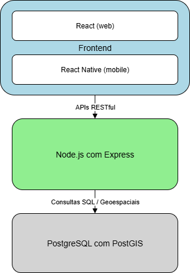

# Arquitetura

## Descrição
Arquitetura MVC com camadas separadas para escalabilidade e manutenção.

## Componentes
- Frontend: React (web), React Native (mobile).
- Backend: Node.js com Express.
- Banco de Dados: PostgreSQL com PostGIS.

## Padrões Arquiteturais
- RESTful APIs para comunicação entre camadas.
- JWT para autenticação e autorização.

## Diagrama

## Decisões Técnicas
- Node.js por ser leve e eficiente para APIs.
- PostgreSQL com PostGIS por suporte a dados geográficos.
